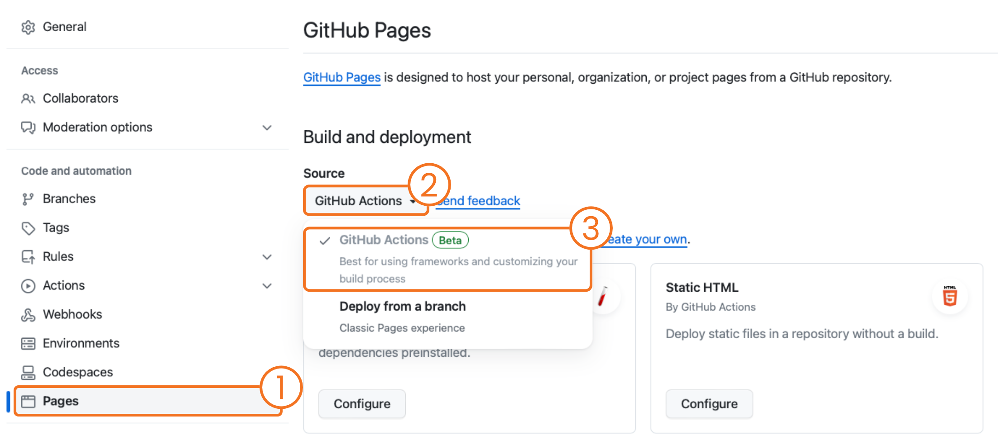
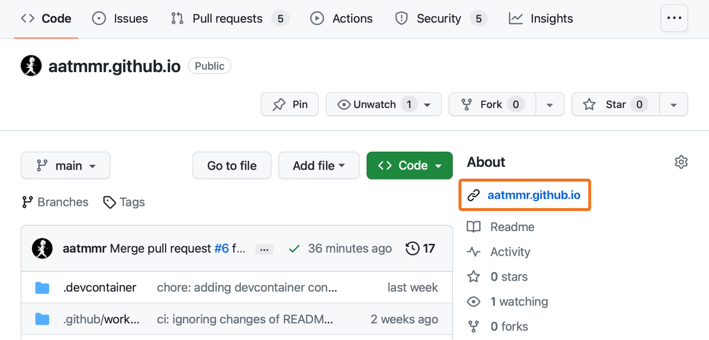
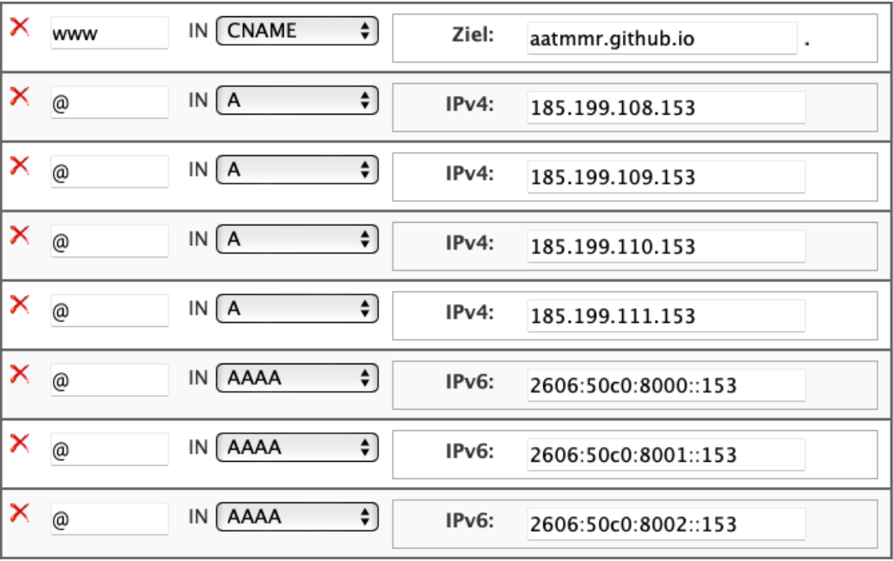
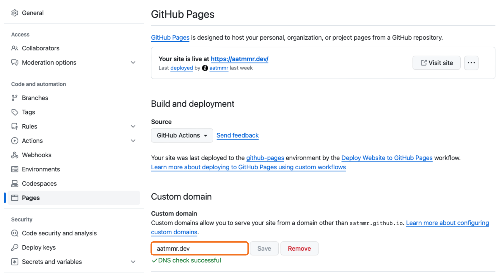
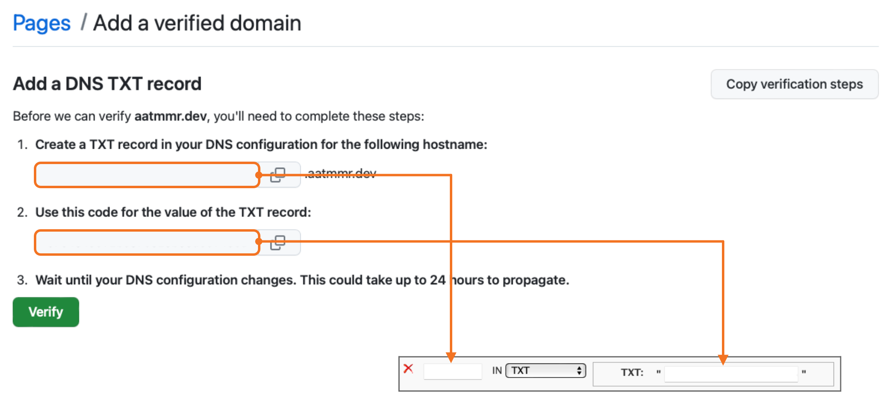
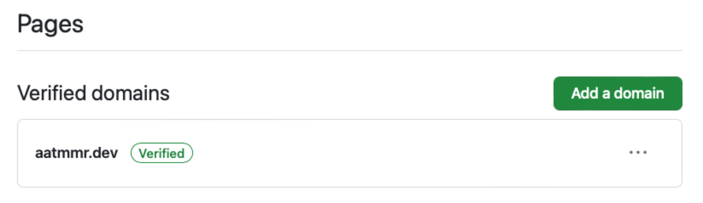

[Astro](https://astro.build) is a modern front-end framework for building fast, optimized websites. It allows you to write components using your favorite JavaScript framework (like React, Vue, or Svelte), but renders them as static HTML at build time for faster page loads. Additionally, Astro offers server-side rendering capabilities, and integrates well with popular tools and frameworks, enhancing performance and SEO.

[This blog](https://github.com/aatmmr/aatmmr.github.io) is build with [Astro](https://astro.build) and deployed to [GitHub Pages](https://pages.github.com) using [GitHub Actions](https://github.com/features/actions). As promised in my [initial post](./start-blogging), I will describe how this site is deployed and what configuration need to be made to succeed, even with a custom domain in mind. Astro itself provides [detailed instructions](https://docs.astro.build/en/guides/deploy/github/) themselves which should be used as well.

## Prepare Project

A working Astro site in a repository on GitHub is needed for the subsequent steps. In case you need a project to start with you can use

```
npm create astro@latest -- --template satnaing/astro-paper
```

to create the base code of this blog using the [Astro Paper theme](https://astro.build/themes/details/astro-paper/).

Choose the repository name as `{your-handle}.github.io` because GitHub recognizes this as your personal page and provides the respective domain for free. You can, however, choose any other name if you use a custom domain without needing the url provided by GitHub, or are fine with the default url your page will be available at `https://{your-handle}.github.io/{name-of-repository}`.

This tutorial will use `{your-handle}.github.io` as repository name for simplicity.

> Please note that the repository has to be public if you are using the free GitHub plan. The repository can be private if you have a paid GitHub plan, such as GitHub Pro for personal use from GitHub Teams on if the repository is located in an organization.

## Enable GitHub Pages

GitHub Pages needs to be enabled for the repository.

1. Go to _Settings > Pages_ of the repository (1)
2. Select _GitHub Actions_ as source (2) and (3)



By default, there should be no workflow available in the repository of an astro page and, therefore, nothing happens after selecting GitHub Actions as source.

## Add Workflow that deploys Page

Now that GitHub Actions is selected as source of GitHub Pages, a workflow needs to be added to the repository. Create a new workflow file, e.g. `.github/workflows/deploy-website.yml`, and paste the following code into the new file and commit the changes to the default branch. Be aware that the workflow has to be on the default branch, in my case `main`, in order to be working properly - if not, nothing will be deployed.

```yaml
name: Deploy Website to GitHub Pages

on:
  push:
    branches: [main]
    paths-ignore:
      - README.md
  workflow_dispatch:

jobs:
  build:
    name: Build
    runs-on: ubuntu-latest
    steps:
      - name: Checkout Repository
        uses: actions/checkout@v4
        with:
          show-progress: false
      - name: Install, build, and upload site
        uses: withastro/action@v1

  deploy:
    name: Deploy
    needs: build
    runs-on: ubuntu-latest
    permissions:
      pages: write
      id-token: write
    environment:
      name: github-pages
      url: ${{ steps.deployment.outputs.page_url }}
    steps:
      - name: Deploy to GitHub Pages
        id: deployment
        uses: actions/deploy-pages@v2
```

The workflow uses the [`withastro/action`](https://github.com/withastro/action) Action provided by Astro that builds the project ready to be deployed to GitHub Pages. Once the page is successfully build in the first job, GitHub's [`actions/deploy-pages`](https://github.com/actions/deploy-pages) Action deploys the site to GitHub Pages. Please note that the specified `permissions` as well as the `environment` information is required for the deployment to GitHub Pages.

To see if it works go to the _Actions_ tab of the repository and check if the workflow is running. Once the workflow succeeded, the page is available at `https://{your-handle}.github.io` or the domain provided by GitHub if you are not using the specific repository name. The easiest way is to get to the root of your repository in the GitHub UI and look for the url in the _About_ section as shown in the screenshot below.



## Use Custom Domain

GitHub Pages is able to provide the site at a domain that you provide. The [documentation](https://docs.github.com/en/pages/configuring-a-custom-domain-for-your-github-pages-site/managing-a-custom-domain-for-your-github-pages-site) is detailed and the subsequent steps are meant to provide all necessary steps in a concise manner. It requires a domain of your choice and access to the DNS settings of that domain.

Don't be confused as we are going to set `{your-handle}.github.io` as target for your custom domain in some of the steps below. This is required as the domain `{your-handle}.github.io` co-exists with the custom domain and the site is still reachable at this domain.

### Prepare DNS

The DNS settings for your domain need to be prepared. Depending on if you want to use a subdomain, such as, `www` and `blog` or if you want to use an apex domain, i.e. no subdomain, the DNS settings need respective entries which I like to unclutter as the documentation was not clear to me in the beginning. To get started, open the DNS settings of your domain and add the following entries depending on your desired setup.

> Please be aware, that DNS updates can take multiple hours to take effect.

#### Use Subdomain only or in combination with Apex Domain (`CNAME`)

If you want to use a subdomain only, add a `CNAME` record type for the wanted subdomain pointing to your GitHub Page with the value

```
{your-handle}.github.io
```

In case you want to use both, apex and subdomain, add this record next to your apex domain below. If not you are all set up and can move on to [Add Domain Configuration to Project](#add-domain-configuration-to-project).

#### Use Apex Domain

To be able to use and apex domain, there are a few options you can choose from, i.e.

- `ANAME` or `ALIAS` record,
- `A` record (IPv4),
- `AAAA` record (IPv6).

Please read carefully the following options and add some in parallel if required or recommended.

**`ANAME` or `ALIAS` Record**

Add an `ANAME` or `ALIAS` record and set the subdomain as `@`. As value enter

```
{your-handle}.github.io
```

That's it and you can continue with the section [Add Domain Configuration to Project](#add-domain-configuration-to-project). If your DNS settings do not provide `ANAME` or `ALIAS` as record type add an `A` or `AAAA` record as described below.

**`A` Record (IPv4)**

Instead of `ALIAS` or `ANAME`, you can enter `A` records (`IPv4`) with `@` as subdomain. Add each of the IP's as separate entries.

```
185.199.108.153
185.199.109.153
185.199.110.153
185.199.111.153
```

**`AAAA` Record (IPv6)**

If you want to add `IPv6` support add the following IP's as `AAAA` record type and `@` as subdomain. Please add an `A` record in parallel as described above because `IPv6` is only slowly adopted.

```
2606:50c0:8000::153
2606:50c0:8001::153
2606:50c0:8002::153
2606:50c0:8003::153
```

The screenshot below is a practical example of my DNS settings of this site with all of the above mentioned settings. Please note that my DNS settings do not provide `ANAME` (or alternatively `ALIAS`) so I added the `A` and `AAAA` records instead.



### Add Domain Configuration to Project

The custom domain needs to be added to the site configuration of your Astro project. Open the file `astro.config.ts` at the root of the project and add your domain (`{your-domain}`) as `site`.

```ts
export default defineConfig({
  site: {your-domain},
```

In addition to that, create a file called `CNAME` (no file extension) in the `public` folder and add as content the domain (`{your-domain}`) of your site:

```
{your-domain}
```

### Add custom Domain to Settings

Now that all is setup and configured the custom domain needs to be added to the GitHub Pages settings of the repository. So return to _Settings > Pages_ and add your custom domain in text field in the _Custom Domain_ section.



## Verify and Secure your Custom Domain

It is possible that your domain can be taken over or misused while GitHub Pages is disabled. To prevent other GitHub users to use your domain with their pages configurations GitHub provides a verification for you custom domains.

Open your personal pages settings via _Avatar > Settings > Pages_ and add your domain. GitHub will provide `TXT` record settings you need to add in your domain's DNS settings.



Once your DNS settings are live you can click _Verify_. If the verification succeeds the domain will be listed respectively and is secured.



That's it - your are set up, your site is live and domain secured 🥳
