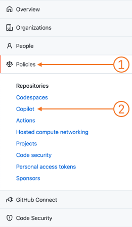
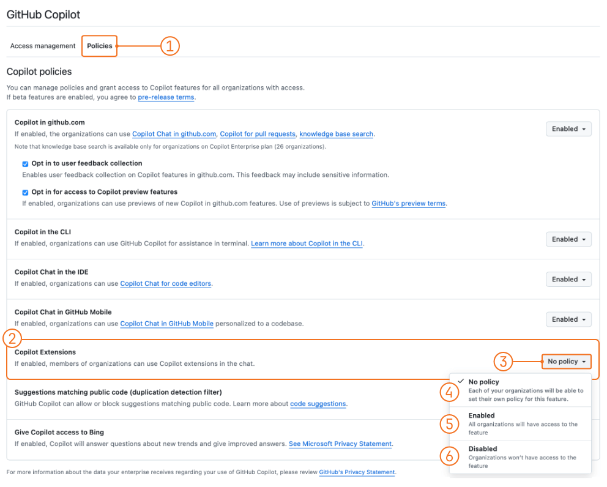
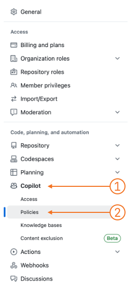
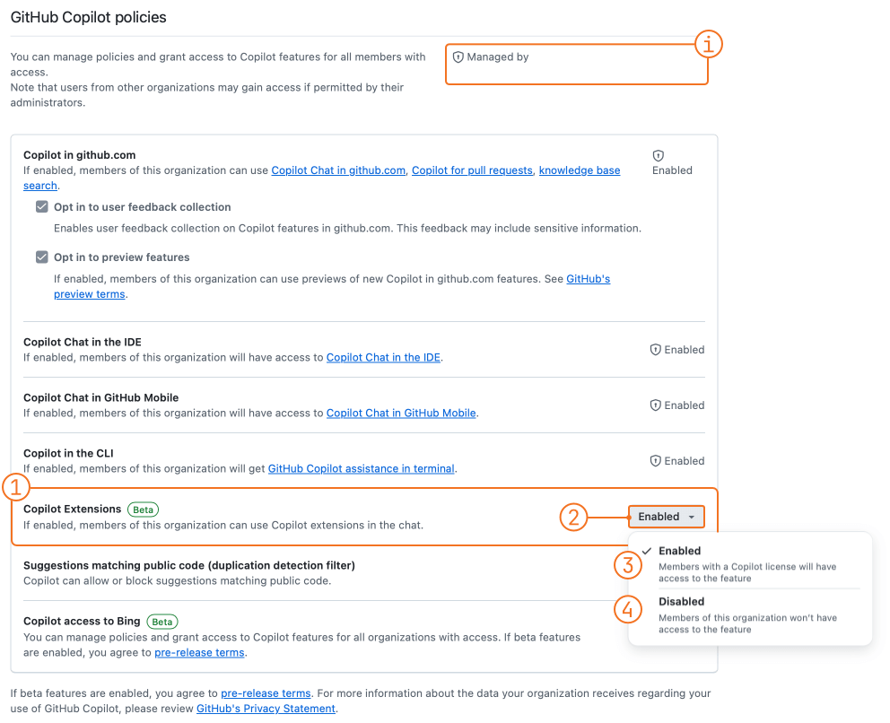

> [GitHub Copilot Extensions](https://github.blog/news-insights/product-news/introducing-github-copilot-extensions/) are in **public beta** at the time of this writing. If changes are made to the setup, the article will be updated.

[GitHub Copilot Extensions](https://github.blog/news-insights/product-news/introducing-github-copilot-extensions/) were recently announced as public beta and are now ready to be explored. As of [docs](https://docs.github.com/en/copilot/using-github-copilot/using-extensions-to-integrate-external-tools-with-copilot-chat), everyone can use and create GitHub Copilot extensions. Users with an Individual subscription can start right away without any further actions. Users with a GitHub Copilot Business or Enterprise subscription need their enterprise administrator and/or organization owners to enable this feature.

This article will describe all the settings that enterprise administrators and organization owners need to take to enable their users to create GitHub Copilot Extensions. See the respective settings below, depending on whether you maintain an entire enterprise, organization, or both.

## Enterprise Level

As an enterprise administrator, you need to go to the enterprise settings. 

1. Click on your avatar on the top right and select "Your Enterprises". 
2. Look for the respective enterprise and click "Settings" which is located at the right of the row.
3. Select "Policies" from the menu on the left (1)
4. Select "Copilot" (2)

In the "Copilot" section:

1. Select "Policies" from the top (1)
2. Look for the row "Copilot Extensions" (2)
3. Select the respective policy (3)

The following policies are available:

- **No Policy** (4) - Organization owners will decide if the feature is turned on or off. When selected, the default in the organization is *off*.
- **Enabled** (5) - The feature is enabled for all organizations in the enterprise, and organization owners **cannot** turn it *off*.
- **Disabled** (6) - The feature is disabled for all organizations, and organization owners **cannot** turn it *on*.

## Organization Level

Organization owners can decide the policy for all organization members, if not disabled by the enterprise administrators (see previous section). To make changes to the settings, go to

1. Organization settings
2. Select "Copilot" in the "Code, planning and automation" section (1)
3. Select "Policies" (2)

In the policies sections,

1. Search for the row "Copilot Extensions" (1)
2. Select the respective policy (2)

The following policies are available:

- **Enabled** - enables access to copilot extensions for every member (3)
- **Disabled** - members are not able to access this feature (4)

Note that at the upper right corner of the organization settings denotes the parent enterprise managing these settings. If a settings is enforced at enterprise level, the settings cannot be changed at organization level. To indicate this to the users, the respective settings has a lock icon and is greyed out. In case you need to change the settings, you need to go to the enterprise settings or contact and enterprise admin.

I hope this helps to navigate the settings and fulfill the wishes of you enterprise and organization members 😊.