GitHub has many built-in features that allow for configurations that are not immediately visible to users. One of such is the enforcement of certain branch and commit naming conventions, which is helpful when working with third-party applications that are connected via GitHub Apps, such as JIRA or Azure DevOps.

Organisation and repository rulesets provide an easy way to introduce such enforcements. The following rulesets are available

- Branches,
- Tags,
- Pushes,

and are used to ensure that Pull Requests require approvals, CODEOWNER settings are taken into account, status checks are met before merging, certain files cannot be pushed, and much more.

When working with tools, such as JIRA and AzureDevOps, conventions are used to update issues and tickets when developers create a branch or push a commit, for example, a branch name starts with project ID and issue number or both are within a commit message.

This article shall help to get started to setup such rules and derive own rulesets.

## Creating New Ruleset

1. Create a new branching rule set

   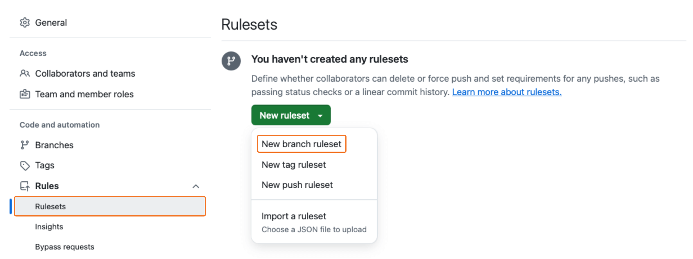

2. Provide name and enforcement status. Start with evaluate to see if the rule works as intended and set to active once all is working.

   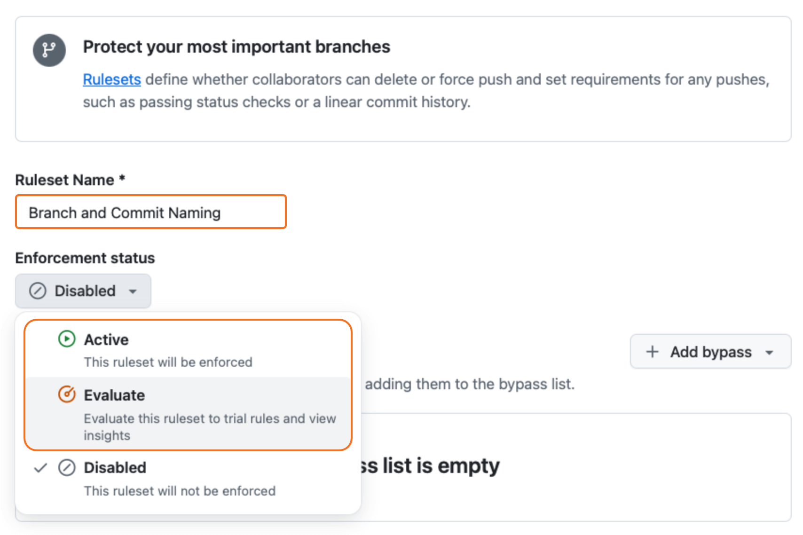

3. Decide if this rule can be bypassed by roles or specific users or only apply to a certain set of repositories.

4. Decide which branches are targeted or excluded, e.g. `main` or `release/**`. This example will enforce the rule on all branches except the specified ones.

   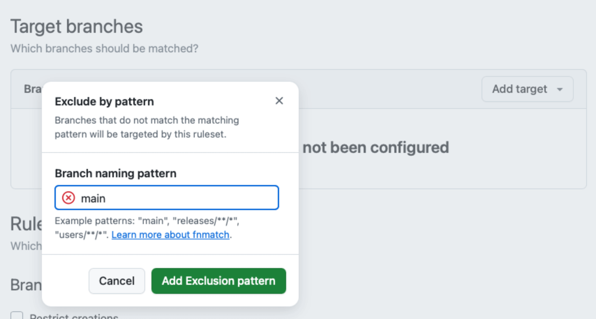

5. Scroll to the end of the settings and find the section "Restrictions"

   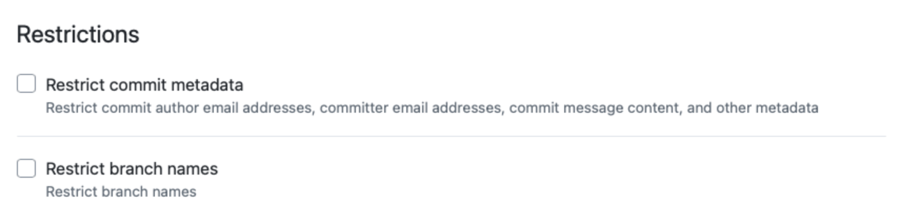

## Restrict Branch Names

1. Check "Restrict branch names"

2. Click "Add restriction"

3. Leave "Applies to" at "Branch name"

4. Select from "Requirement" the item "Must match a given regex expression"

   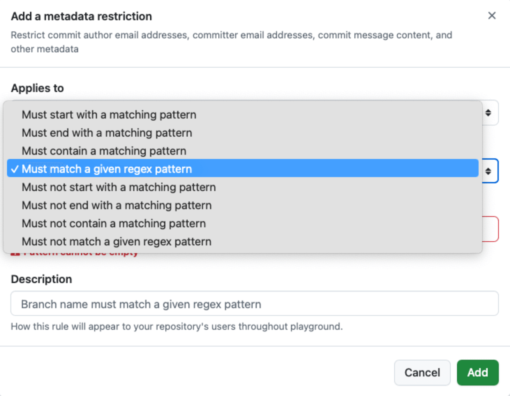

5. Create a designated regex expression, e.g. using GitHub Copilot using following prompt that should result in `^[A-Z]{2}-\d{1,4}-[A-Za-z0-9\-]+$`.

   ```md
   Create a regex expression that limits a name to the following format: ID-index-description.

   - ID consists of 2 digits
   - Index is an integer with up to for digits
   - Description consits of characters and numbers and no spaces following the rules of GitHub. Slashes are not allowed

   ## Examples

   - AB-1-some-branch-name
   - BA-23-some-feature-1
   - CA-123-some-other-feature-3
   ```

6. Provide a description of the rule

   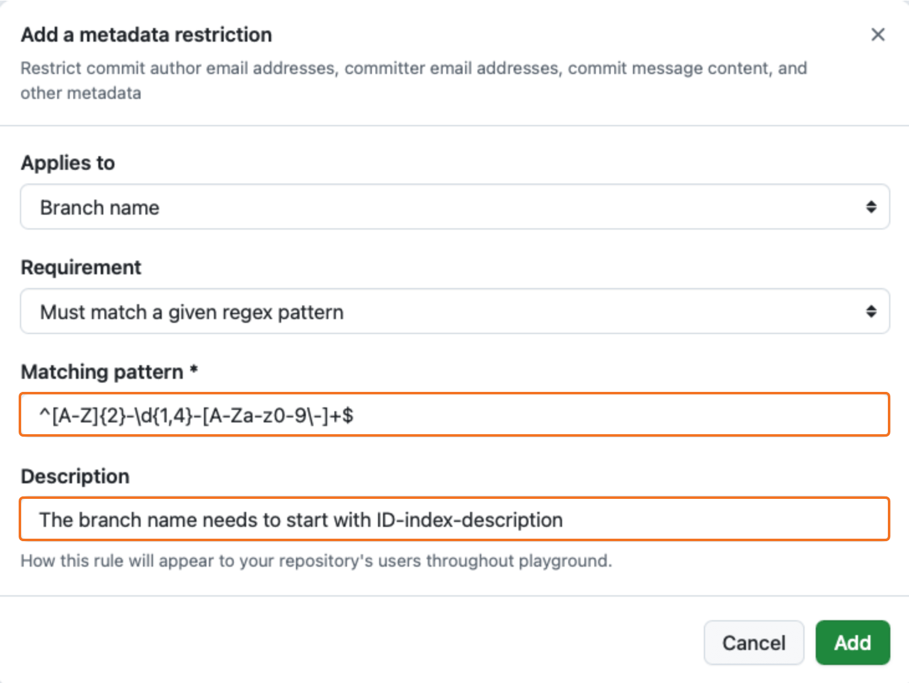

7. Save the rule set with "Create"

8. Now create a new branches, one that violates the rule and one that complies with the rule

   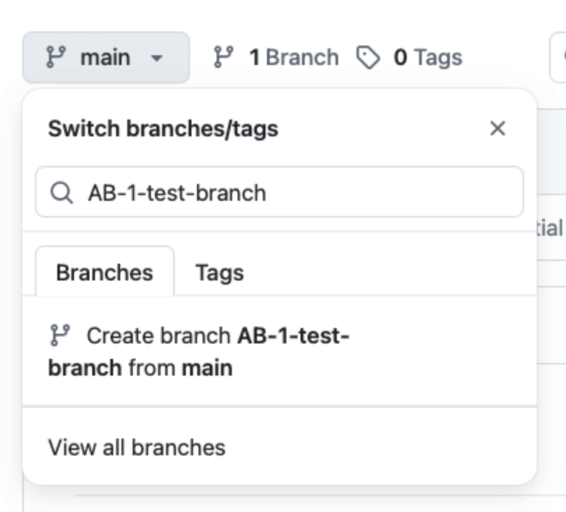

9. Navigate back to the settings and select "Insights" from the "Rules" section. Choose "Evaluate rules" and see if the rule failed and passed once.

   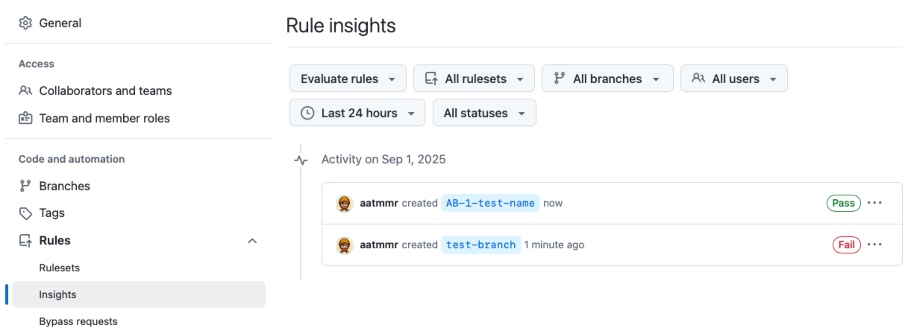

10. Now, set the ruleset can now be set to "Active"

11. Try to create a branch with a violating name. A error toast appears on the bottom left that the branch cannot be created due to a naming violation.

    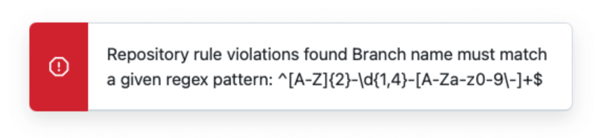

## Restrict Commit Message Format

1. Create a regex expression that enforces convetional commits, such as `^(feat|fix|chore|docs|style|refactor|perf|test|build|ci|revert|other)(\([a-zA-Z0-9\-]+\))?:\s.+$`.
2. Navigate back to the rule settings and edit the previous rule
3. Scroll to "Restrictions" and check "Restrict commit metadata" in the "Restrictions" section
4. Click "Add restriction"
5. Leave "Applies to" at "Commit message"
6. Select from "Requirement" the item "Must match a given regex expression"
7. Paste the regex at "Matching Pattern"
8. Provide a description

   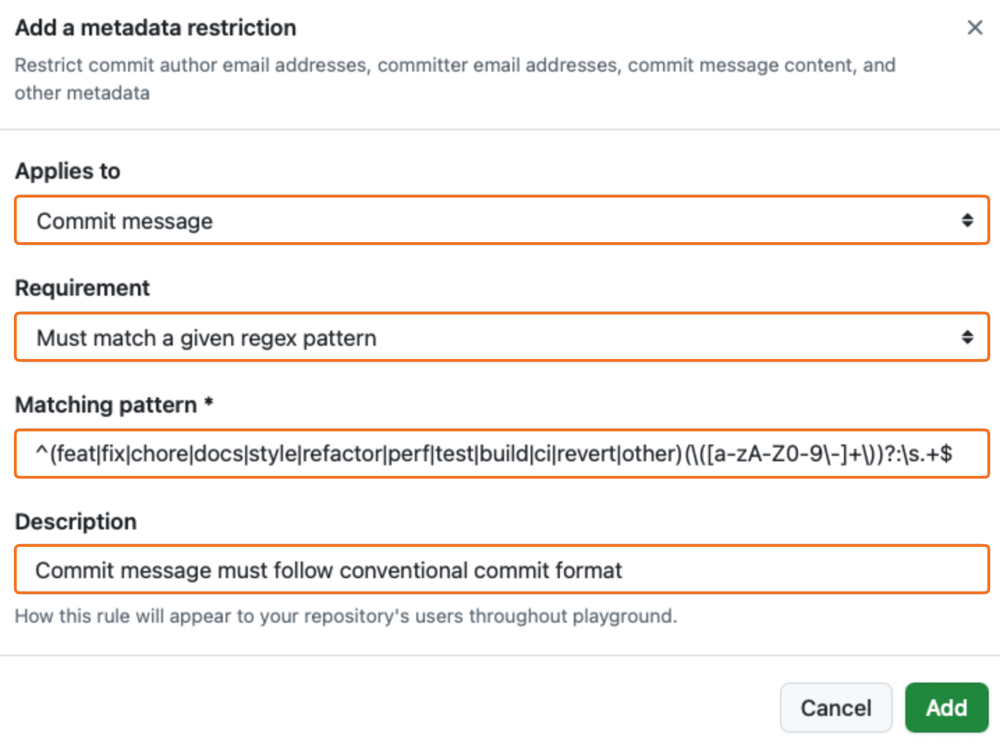

9. Set "Enforcement Status" back to evaluate
10. Save the changes
11. Make test commits and evaluate with the rule insights
12. Set the ruleset to "Active" if all works
13. Try to create a commit with a violating message. An error appears in the commit window.

    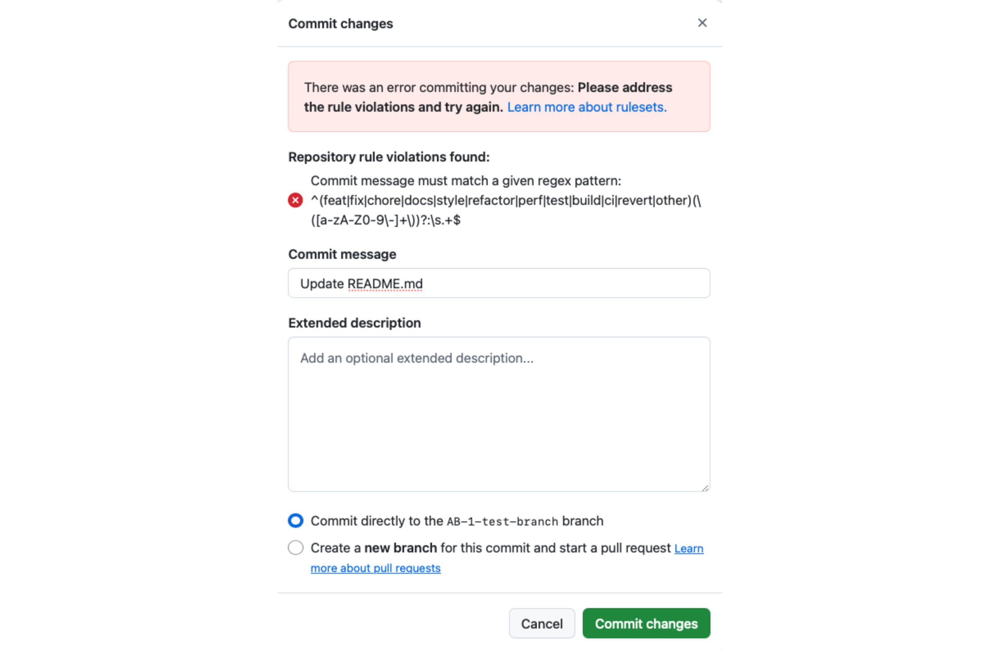

## Error Messages when Pushing Locally

The error messages displayed above are exclusively visible when developers are accessing the WebUI of GitHub. However, when pushing a branch or commit from a development environment, such as the command line or an IDE, that deviates from the naming conventions, developers will encounter the corresponding errors.

**Branch Name**

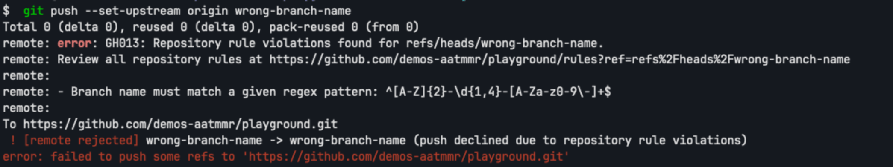

**Commit Message**

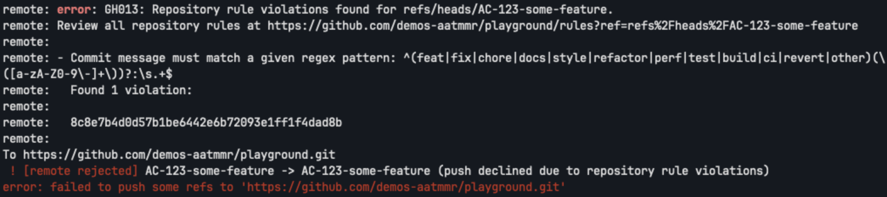

## Limitations in Error Readability

At the time of writing this article, the error messages are not necessarily straightforward for developers to comprehend. The WebUI and terminal displays the regex expression rather than providing a detailed description of the rule, which can be challenging for developers unfamiliar with regular expressions.

Furthermore, when utilizing the built-in Git tooling within Integrated Development Environments (IDEs), such as Visual Studio Code, the error messages can become even more cryptic. For instance, when pushing an invalid branch name or commit message, the error window does not display any related information,


even pointing to a wrong cause due to unsynchronized refs. When opening the Git Log, the output of the git log is shown with the error - still in the same "cryptic" format as in the WebUI or terminal.

**Branch Name**

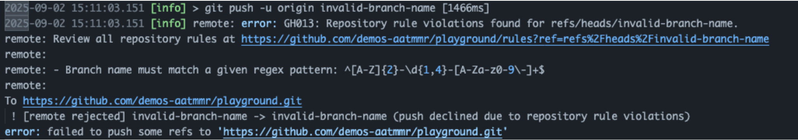

**Commit Message**

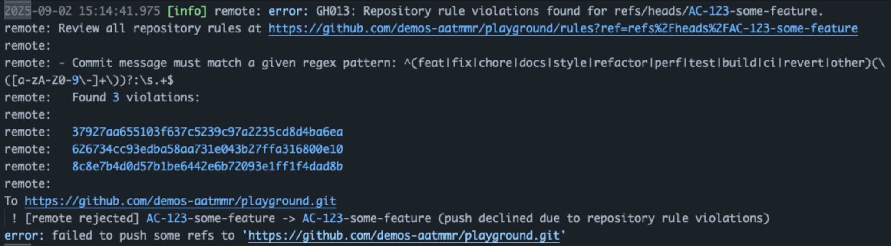
