> [GitHub Copilot Extensions](https://github.blog/news-insights/product-news/introducing-github-copilot-extensions/) are in **public beta** at the time of this writing. If changes are made to the setup, the article will be updated.

[GitHub Copilot Extensions](https://github.blog/news-insights/product-news/introducing-github-copilot-extensions/) allow to create own agents that can be used in a chat with GitHub Copilot. To get started, we will discover how to create a basic agent that can be used in a chat with GitHub Copilot. There are a few steps involved in creating and install an extension, which will be covered in this article, namely:

- Create repository for the extension
- Configure Codespaces to develop the extension and run the agent
- Create a GitHub App required to run the extension and connect it to the Codespace

We use Codespaces because it is convenient and can be set up in minutes. It also allows us to easily host the extension without any further service involvement. In a later article, we will cover how to host the extension on an external service that runs the agent.

## Table of contents

## Create Repository for the Extension

We start with a blank repository. Create it using the GitHub UI or locally using `git init`. As best practice, the following files are added:

- `README.md` - A description of the extension
- `.gitignore` - A file to ignore files that should not be committed to the repository. Feel free to use GitHub Copilot to add the most common items for nodeJS and your operating system.

That's it for the repository. The next step is configuring Codespaces to develop the extension and run the agent in a quick and easy development environment.

## Set Up Codespaces

To configure Codespaces, we must create a `.devcontainer` directory with a `devcontainer.json` file. The `devcontainer.json` file contains the configuration for the Codespace, such as the image to use, the environment variables, and the ports to expose. Add the following code to the `devcontainer.json` and commit it.

```json
{
  "name": "aatmmr-howto-github-copilot-extension",
  "image": "mcr.microsoft.com/devcontainers/typescript-node:1-22-bookworm",
  "postCreateCommand": "npm install",
  "forwardPorts": [3000],
  "postStartCommand": "export CODESPACE_NAME=$(gh codespace view --json name -q .name); gh codespace ports visibility 3000:public -c $CODESPACE_NAME",
  "features": {
    "ghcr.io/devcontainers/features/github-cli:1": {}
  },
  "customizations": {
    "vscode": {
      "extensions": ["github.copilot", "github.copilot-chat"]
    }
  }
}
```

The following configuration is used:

- `name` - The name of the Codespace, here according to the extension we are building.
- `image` - The image to use for the Codespace. The extension runs on nodeJS, so we use the `mcr.microsoft.com/devcontainers/typescript-node:1-22-bookworm` image.
- `postCreateCommand` - The command to run after the Codespace is created. Here we install the dependencies using `npm install`.
- `forwardPorts`- The port forwarded from the Codespace. Here, we forward port 3000. The port will expose the agent to the outside world, which is required by the GitHub App to connect to the agent.
- `postStartCommand` - The command to run after the Codespace is started. Here, we set the port's visibility to public. This improves quality of life, as it is not necessary to set the port's visibility manually to public every time the Codespace starts.
- `features` - The features to enable for the Codespace. Here, we enable the GitHub CLI, which we need for `postStartCommand` to set the port's visibility to public.
- `customizations` - For the customizations for the Codespace, we install the GitHub Copilot and GitHub Copilot Chat extensions here.

## Add the basic Extension Code

The extension will use the [Copilot Extensions Preview SDK](https://github.com/copilot-extensions/preview-sdk.js) (`@copilot-extensions/preview-sdk`) as it is easy to use and encapsulates all the code required to interact with the GitHub Copilot Chat.

First, we need to initialize the project running

```bash
npm init -y
```

and then install the SDK running

```bash
npm install @copilot-extensions/preview-sdk
```

This initializes the project as nodeJS project and adds a `package.json` file to the repository which should look like the following

```json
{
  "private": true,
  "type": "module",
  "scripts": {
    "start": "node index.js",
    "watch": "node --watch index.js"
  },
  "dependencies": {
    "@copilot-extensions/preview-sdk": "^5.0.0"
  }
}
```

The next step is to add the code for the agent. We start with a simple agent that returns a static greeting. Create a file called `index.js` in the root of the repository and add the following code

```javascript
import { createServer } from "node:http";

import {
  createTextEvent,
  createDoneEvent,
} from "@copilot-extensions/preview-sdk";

const server = createServer((request, response) => {
  console.log(`Received [${request.method}] to [${request.url}]`);

  if (request.method === "GET") {
    return response.end("ok");
  }

  response.write(createTextEvent("Hej 🤓 this is the extension speaking!"));
  
  response.end(createDoneEvent());
});

const PORT = 3000;

server.listen(PORT, () => {
  console.log(`Server is running on port ${PORT}`);
});
```

Let's break down the code:

**Imports**

The `createServer` function from the `node:http` module and the `createTextEvent` and `createDoneEvent` functions from the `@copilot-extensions/preview-sdk` module are imported. The `createTextEvent` function is used to create a text event sent to the chat, and the `createDoneEvent` function is used to create a done event sent to the chat. The `createDoneEvent` function is **important** as it indicates that the agent has finished processing the request.

**The Server Function**

The server is defined using the `createServer` with a callback function that is called for every request the server receives. This is where the Copilot Chat prompt is received and processed.

For debugging purposes, the incoming request is logged. The request is then checked to see if the method is `GET`. If so, the server returns `ok` to the response and ends the response. This is done to check if the server is running and reachable.

Any other call is assumed to be a chat prompt, and the server writes a text event with the message *"Hej 🤓 this is the extension speaking!"* to the response. The server then writes a done event to the response to notify the chat that the agent has finished processing the request. 

Writing the done event is very important to notify the chat that the agent has finished processing the request. If the done event is not written, the chat will hang and wait for the agent to respond.

**Starting the Server**

The server listens on the port specified by `PORT`, which is set to `3000`. Finally, the server starts listening to the defined port and logs that it is running on the specified port.

That's it for the basic agent. Now start the Codespace and wait until it is ready. Once it is ready, run the following command in the terminal to start the agent and listen to incoming requests:

```bash
npm run start
```

## Create and Install GitHub App

The required GitHub App can be created in a user namespace or in an organization and set to be private or public. For this tutorial, the app is created in a user namespace and kept private. 

To create the GitHub App, go to your user settings through the avatar on the top right of the GitHub UI. Scroll down until you see "Developer Settings" appear on the left.

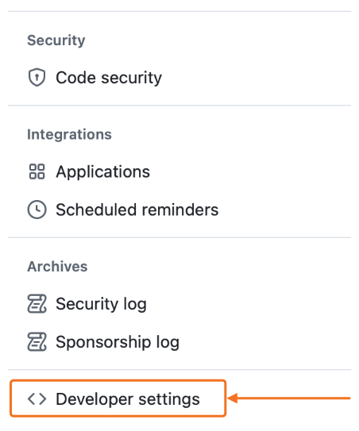

Choose "GitHub Apps" from the next menu to view an overview of all your apps. Click on "New GitHub App" to create a new app.

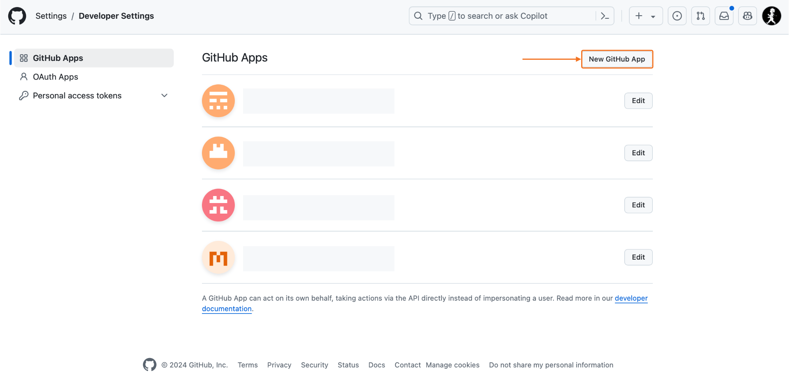

Start creating the new app by giving it a name (1), description (2), and homepage URL (3). The homepage URL can be any URL, for example, the URL of the extension's repository.

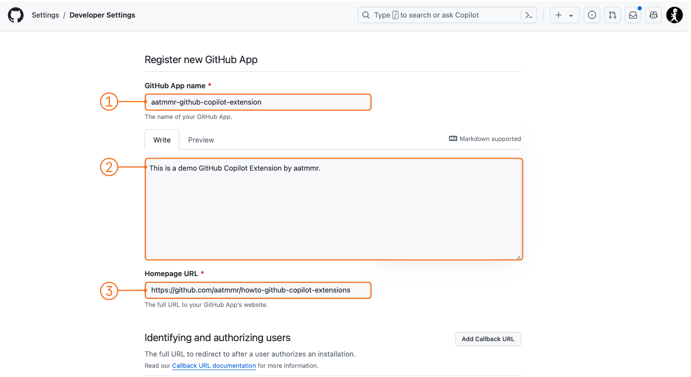

Scroll further down and deactivate webhooks (4).

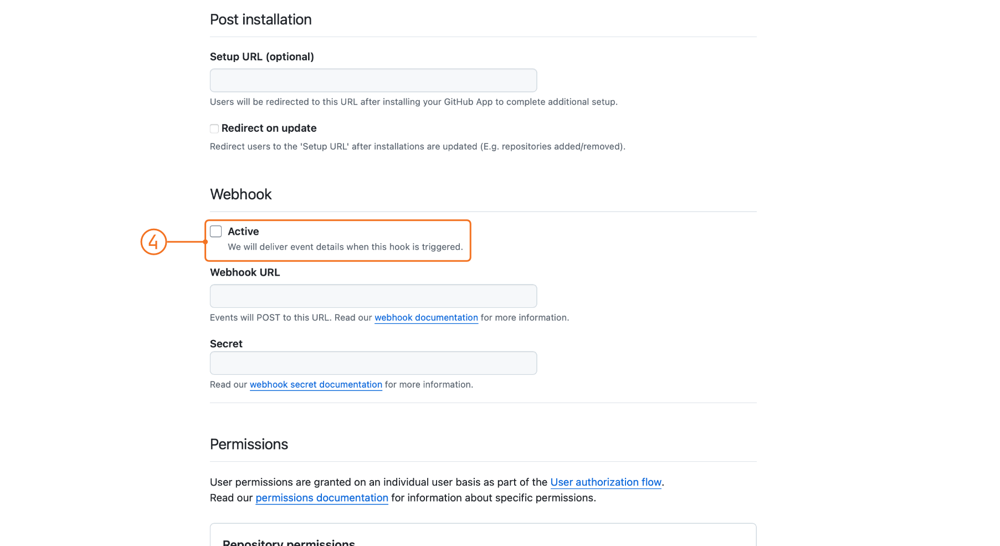

Open the "Account Permissions" section, look for "Copilot Chat" (5), and select "Read-only" (6). **This is important** to get access to the user prompt.

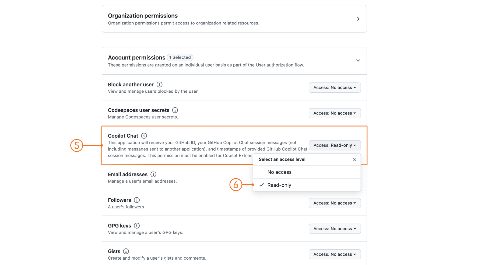

Scroll to the end and decide if the app is only for your account or public. For this tutorial, the app is kept private (7). Click "Create GitHub App" to create the app (8). GitHub will redirect you to the settings of the app afterwards.

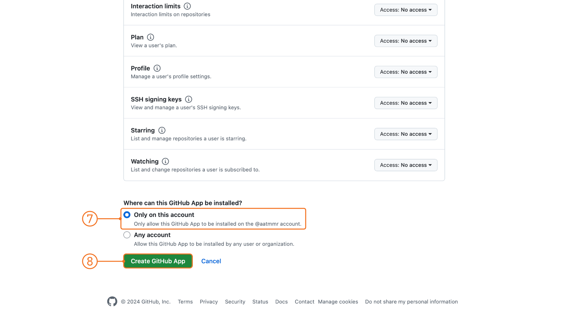

Now switch to the Codespace and select the "Ports" tab (9). The running Codespace should be listed, including the port 3000. Copy the "Forwarded Address" (10) and make sure that the port is set to "Public" (11). The URL should be of the format

```
https://{codespace-name}-{some-id}-{port}.app.github.dev/
```

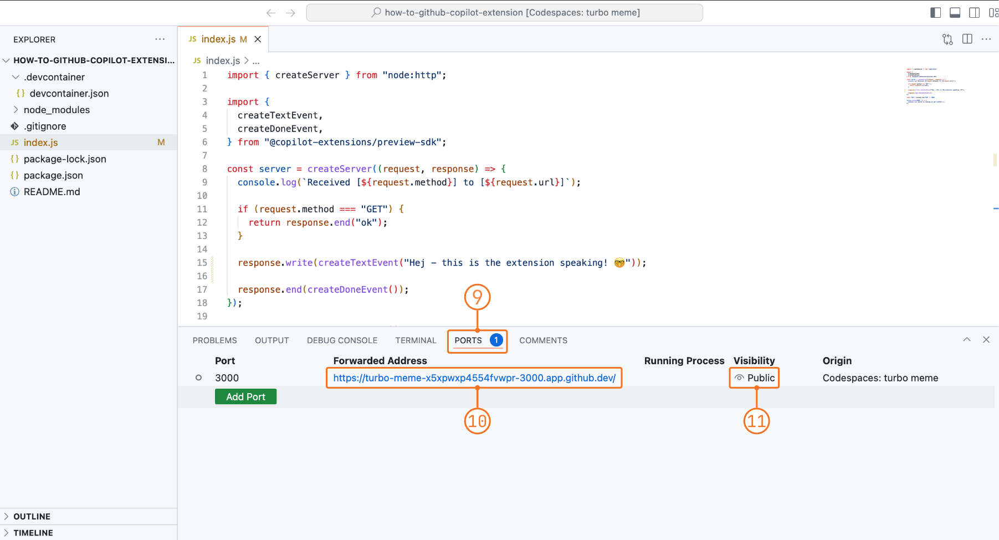

Switch back to the settings of the created app and paste the copied "Forwarded Address" into the "Callback URL" box (12). Then, select "Copilot" from the menu at the top left (13).

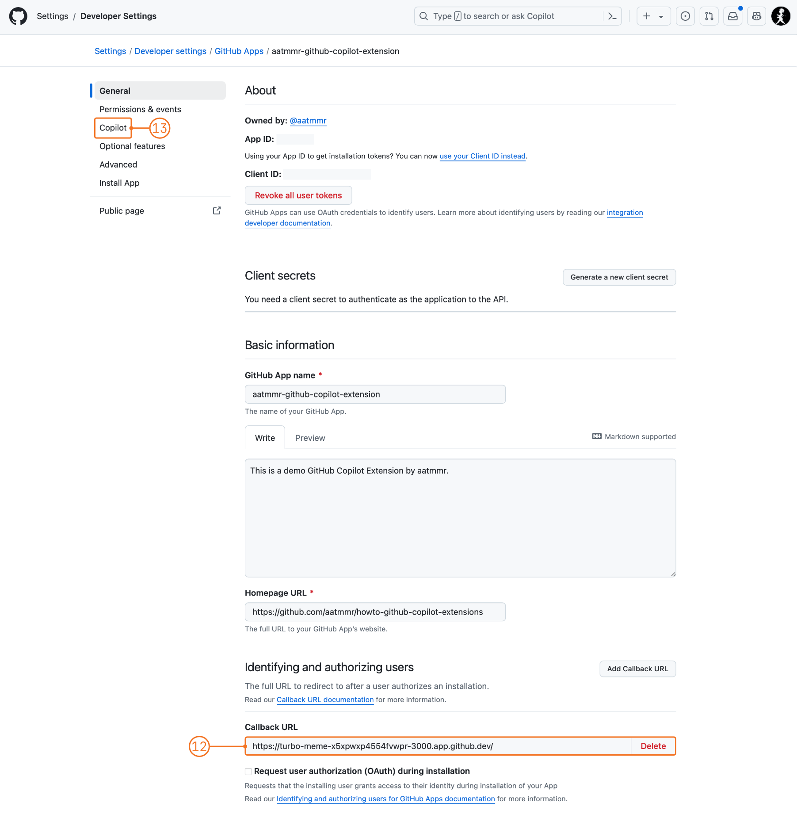

Select "Agent" as type "App Type" (14), paste the "Forwarded Address" as URL (15), and add an "Interference description" (16). The "Interference description" is a description of the agent that will be shown as a short description next to the agent's name in the used chat. Do not forget to save the changes.

The app must be installed in the respective account in order to be used. To do so, click on "Install App" (17).

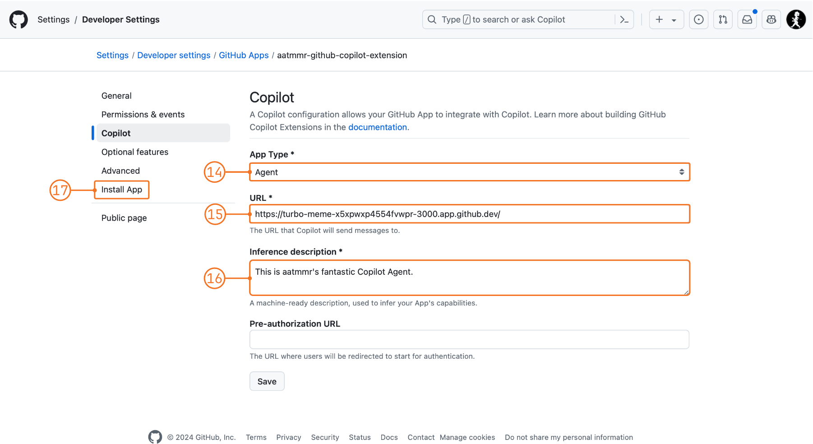

Select "Install" (18) to install it into your account.

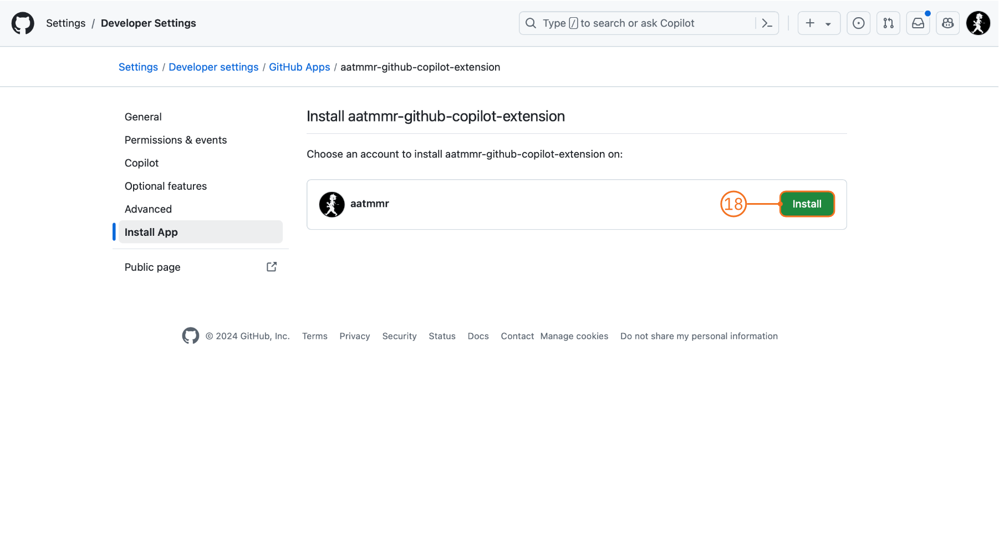

Select "Install" from the install menu (19), granting read access to Copilot Chat.

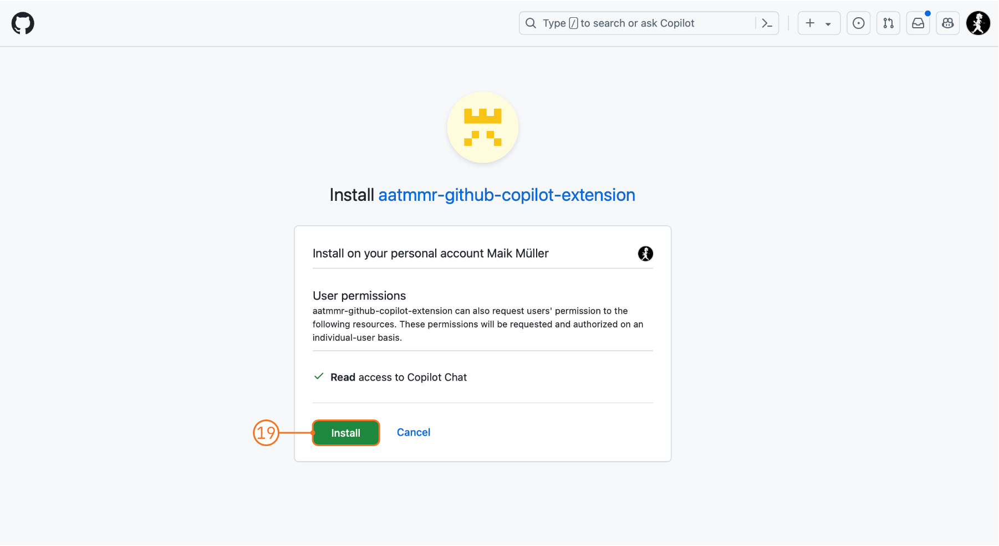

Done 🎉 The app is now installed and can be used in the chat with GitHub Copilot. It is listed as a GitHub App in your account. Selecting "Edit" allows you to make changes if necessary.

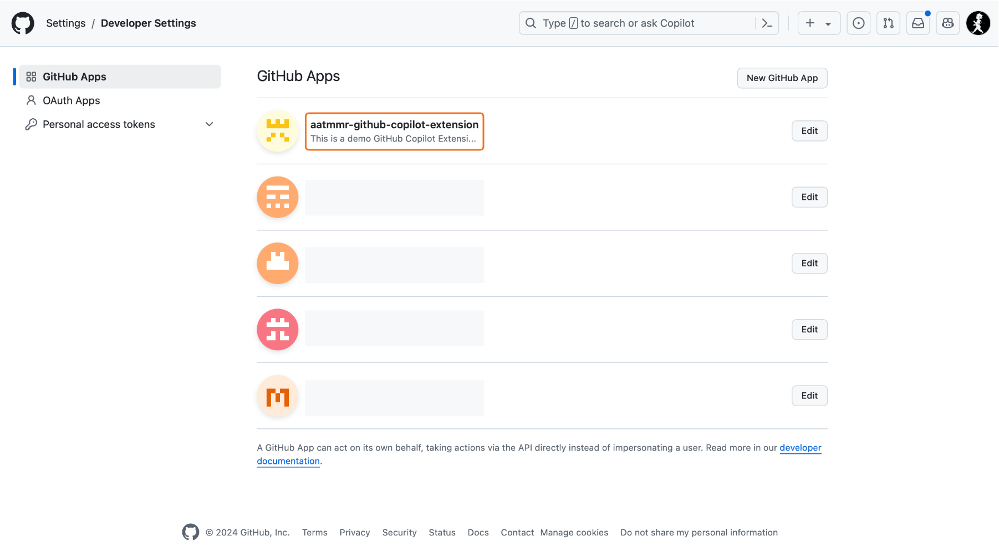

## Run and Test the Agent

Ready to test 😬? Open Copilot on GitHub.com and select "General Purpose Chat". Type `@` (1) and the name of the agent (`aatmmr-github-copilot-extension` in this case) to see the agent in the list of suggestions (2). Select the agent to start the chat.

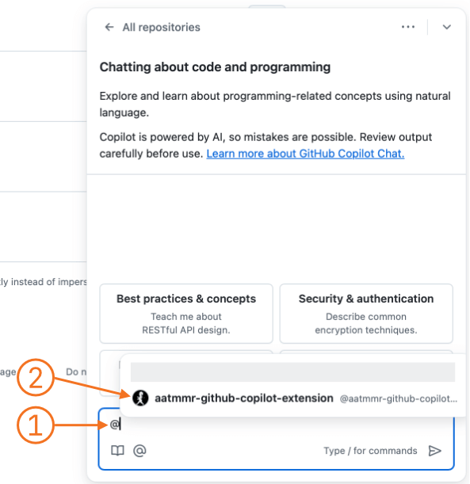

When using an agent for the first time, users have to consent and connect to it. Select "Connect" (3) and

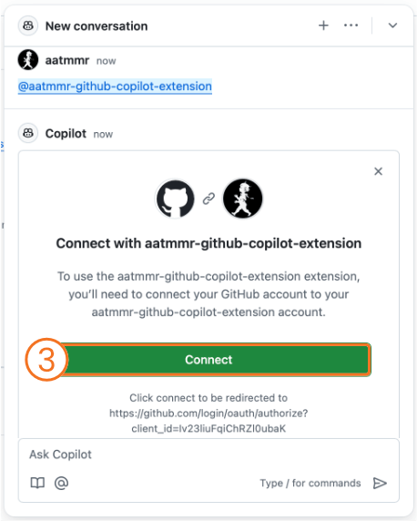

authorize the agent to access the chat (4).

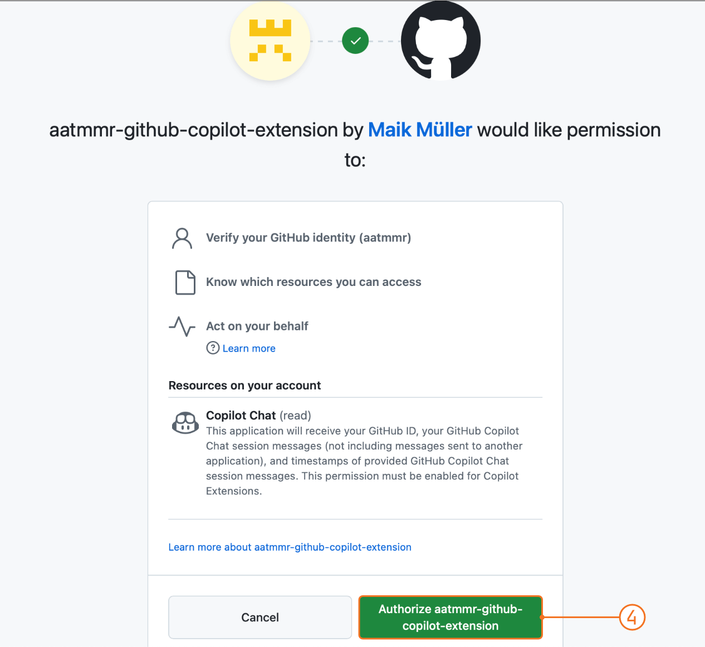

Once done, hit enter to submit the prompt. The prompt can be anything or empty, as it will return a static greeting. If everything works as expected, the agent will respond with the greeting (5).

If an error with code 401 is shown, make sure the Codespace is still running and that the application is started (`npm run start`).

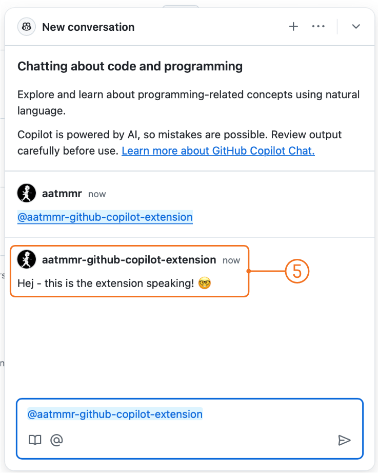

The agent is also immediately available in VSCode. Open a Copilot Chat conversation and type `/help`. The agent is listed among all others available to your account (7). Repeat the previous exercise to test the agent in VSCode (8) to get the greeting.

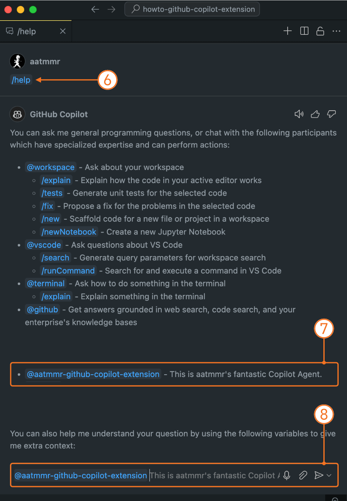